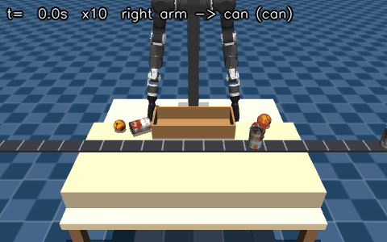

# OpenArm + Inspire Hand + D435 Pick & Place



*Task bàn + băng chuyền trong MuJoCo: FoundationPose 6D, grasp library, mink QP, 2 tay — 6/6 vật vào rổ trong 196 s (phát x10). Tạo lại: `python -m scripts.make_replay_gif artifacts/bin_conveyor_mink_frames.npz --speed 10`. Báo cáo tuần: [docs/BAO_CAO_TIEN_DO_2026-10-02.pdf](docs/BAO_CAO_TIEN_DO_2026-10-02.pdf).*

Pipeline ROS 2 theo thiết kế của mentor:

`D435 RGB-D → /perception/object_pose (PoseStamped) → TF camera/base → MoveIt IK theo waypoint → FollowJointTrajectory 7-DOF → ros2_control`

Inspire RH56DFX nhận `custom_ros_messages/MotorCmds` qua `/hands/cmd`, đúng thứ tự driver `right[6] + left[6]`. Giá trị `open`/`grasp` trong `config.json` dùng thang raw 0–1000 của RH56.

## Chạy ROS 2

Yêu cầu ROS 2, `realsense2_camera`, `cv_bridge`, MoveIt 2 và controller hỗ trợ `FollowJointTrajectory`.

Môi trường WSL2 đã kiểm tra ngày 21/09/2026 nằm hoàn toàn trên `D:\WSL\Ubuntu-22.04` (không dùng dung lượng ổ C): ROS 2 Humble Desktop, MoveIt2, RViz2, RealSense, ros2_control và `~/ros2_ws`. Workspace dùng các revision:

- `enactic/openarm_ros2`: `4e837e1d0dae692ff67b560b69d8d281d7a8d4ed`
- `enactic/openarm_description`: `14ff67b638ff1c738a1b9a6be8aaa5ce5ed2c831`
- `enactic/openarm_can`: `f340d4b808fb177e1f297af54eb55fd51c6c7c10`

Repo này được symlink vào `~/ros2_ws/src/openarm_pick_place`; stub message nằm tại `~/ros2_ws/src/custom_ros_messages`. Build và chạy demo tay v1.0:

```bash
source /opt/ros/humble/setup.bash
cd ~/ros2_ws
colcon build --symlink-install
source install/setup.bash
ros2 launch openarm_bimanual_moveit_config demo.launch.py \
  arm_type:=openarm_v1.0 use_fake_hardware:=true

# Robot MuJoCo headless đóng vai ros2_control (chạy từ gốc repo)
ros2 run openarm_pick_place mujoco_bridge --ros-args \
  -p config_path:=$PWD/config.example.json
```

WSLg render qua D3D12 (cả Intel và NVIDIA) thường gây lỗi màn hình đen, đơ hoặc crash trên Ogre/RViz2. `demo.launch.py` được cấu hình ép dùng `LIBGL_ALWAYS_SOFTWARE=1` (llvmpipe) và `QT_QPA_PLATFORM=xcb` để đảm bảo hiển thị 3D ổn định tuyệt đối, không bị treo hay văng.

Nếu đóng terminal/cửa sổ RViz thay vì Ctrl+C, `ros2_control_node`/`move_group`/`rviz2` có thể sống sót thành tiến trình mồ côi. Lần `ros2 launch` kế tiếp sẽ tạo ra **hai** node `controller_manager` tranh nhau trên cùng DDS domain: spawner báo `Controller already loaded, skipping load_controller` rồi `Failed to configure controller`, và RViz không hiển thị gì cập nhật dù không crash. Dọn bằng:

```bash
bash scripts/kill_ros2_stack.sh
```

rồi chạy lại `ros2 launch` từ đầu.

```bash
cp config.example.json config.json
colcon build --symlink-install
source install/setup.bash

# Terminal 1: D435, bật aligned depth
ros2 launch realsense2_camera rs_launch.py align_depth.enable:=true

# Terminal 2: perception phát position + orientation trong camera frame
ros2 run openarm_pick_place d435_perception --ros-args -p config_path:=$PWD/config.json

# Terminal 3: IK waypoint → trajectory 7 joint → Inspire Hand command
ros2 run openarm_pick_place motion_planning --ros-args -p config_path:=$PWD/config.json

# Terminal 4: driver Inspire RH56DFX tay trái (ID 2)
ros2 launch rh56_controller rh56_controller.launch.py serial_port:=/dev/ttyUSB0 hand_ids:=2
```

Trước khi chạy motion, TF `base_link ← camera_color_optical_frame`, MoveIt group và controller phải tồn tại đúng như `config.json`. Không dùng ma trận identity trong `calibration.example.json` trên robot thật.

## Chạy kiểm thử

```powershell
.\.venv\Scripts\python.exe -m unittest discover -s tests -v
```

## Chạy MuJoCo

Robot của lab là **OpenArm v1** (mentor xác nhận 18/09). MJCF v1 lấy từ `enactic/openarm_mujoco` và vendor vào `assets/openarm_v1/` (gói pip chỉ có v2). `simulation/openarm_mujoco.py` thay motor mô-men bằng position servo (gain + damping/armature của v2, timestep 1 ms), thêm site flange `*_ee_control_point` trên `link7`. Viewer thay cả hai gripper bằng Inspire RH56DFX trái/phải từ `correlllab/rh56_controller`.

```powershell
# Smoke test không mở cửa sổ
.\.venv\Scripts\python.exe -m simulation.run_simulation --headless

# Mở viewer tương tác
.\.venv\Scripts\python.exe -m simulation.run_simulation

# Demo pick-and-place lon YCB bằng tay phải 5 ngón (viewer, chạy thời gian thực)
.\run_gui.bat --camera isometric        # isometric | close_grasp | front_view | side_view | overhead | free
# Tự đặt Python vào Windows High performance GPU policy (GTX 1650)
# hoặc gọi trực tiếp:
powershell -ExecutionPolicy Bypass -File .\scripts\run_mujoco_gtx1650.ps1 --camera isometric

# Headless: N trial vật lý, ghi artifacts/physics_trials.json
.\.venv\Scripts\python.exe -m simulation.pick_place_demo --headless --trials 3 --arm auto

# Benchmark gate 50 trial cho từng tay (báo cáo luôn nằm trên workspace ổ D)
.\.venv\Scripts\python.exe -m scripts.benchmark_pick_place --arm right --trials 50 --perception
.\.venv\Scripts\python.exe -m scripts.benchmark_pick_place --arm left --trials 50 --perception

# Lấy vị trí vật từ camera đầu D435 (RGB-D → deprojection) thay vì trạng thái sim
.\.venv\Scripts\python.exe -m simulation.pick_place_demo --headless --trials 3 --perception

# Đổi bố cục: vật A và rổ B (x y trên mặt bàn, mét)
.\run_gui.bat --object 0.25 -0.40 --basket 0.42 -0.18

# Thu thập demonstration data: mỗi trial một bố cục ngẫu nhiên đã kiểm tra IK/va chạm
.\.venv\Scripts\python.exe -m simulation.pick_place_demo --headless --trials 8 --randomize --perception --seed 1 --report artifacts/randomized_trials.json
```

### Debug

```powershell
# Chỉ lập kế hoạch: bảng target / reached / sai số / wrist pitch từng phase, không chạy vật lý
.\.venv\Scripts\python.exe -m simulation.pick_place_demo --plan-only

# Dừng sau một phase để soi cảnh (perceive|plan|ready|reach|grasp|carry|release)
.
un_gui.bat --stop-after grasp --camera close_grasp

# Log chi tiết: vị trí vật + wrist sau mỗi phase; --trace in pose + lực ngón mỗi 0.5 s sim
.
un_gui.bat --verbose --trace 0.5
```

Cấu trúc code (`simulation/pick_place/`): `config.py` (mọi tham số) → `kinematics.py` (IK/FK) → `scene.py` (model, index, hình học, contact) → `planner.py` (target + chuỗi IK) → `executor.py` (bước vật lý qua `ctrl`, abort khi va chạm) → `demo.py` (7 phase `phase_*`) → `episode.py` (log + `TrialResult`) → `cli.py`. `simulation/pick_place_demo.py` chỉ là lối vào tương thích.

### Tiêu chí một trial đạt (không có weld / carry-assist / ghi qpos vật)

1. Vật đứng trên mặt bàn (đáy mesh = đáy collision = `TABLE_TOP_Z`).
2. Cổ tay thẳng tại grasp: hướng nắm là FK của `NATURAL_GRASP_JOINTS` (joint6 ≈ joint7 ≈ 0°), bàn tay nối tiếp cẳng tay; tay vươn về phía trước, lòng bàn tay hướng vào giữa.
3. Grasp đối lực: ngón cái ≥ 6 N, ít nhất hai ngón còn lại ≥ 0.5 N và index/middle ≥ 1 N.
4. Proof-lift: tay nâng ≥ 3 cm và vật trượt ≤ 1 cm so với tay.
5. Đáy vật cao hơn mép rổ ≥ 5 cm khi mang; hạ xuống cách đáy rổ 3 cm rồi mới mở tay.
6. Sai số đặt ≤ 2 cm, nghiêng ≤ 15° (góc trục z của vật với phương thẳng đứng).

Mỗi trial ghi đủ: bố cục A/B, vị trí perception + sai số so với ground truth, lực 5 ngón, wrist pitch, proof-lift, clearance, yaw đặt, wrist position và joint target theo từng phase.

`simulation/five_finger_model.py` gắn model Inspire RH56 (6-DOF/12-joint) vào mỗi flange. Transform mount **suy ra từ hai hệ trục**, không tune tay: trục dụng cụ của OpenArm v1 là +z của `link7` (gripper gốc bắt vào mặt flange z = 0.0955); hệ trục gốc bàn tay Inspire có +z = hướng ngón, +x = lòng bàn tay. Bàn tay do đó nối tiếp cẳng tay (lệch 2.0°/2.9°), lòng bàn tay hướng vào thân, ngón cái phía trước khi tay buông thõng (phải: quay −90° quanh z; trái: +90°); đế tay đặt trên mặt flange qua tấm adapter 1 cm. Kiểm tra bằng `tests/test_mujoco.py::test_hands_continue_the_forearm_axis`. Tư thế nắm/tư thế chờ tham chiếu suy bằng `python -m scripts.sweep_postures` — chạy lại khi đổi model tay/cánh tay. Độ dày adapter là giả định — thay bằng CAD thật trước sim-to-real.

`simulation/vision_detector.py` là pipeline perception trong sim (cùng cấu trúc với `openarm_pick_place/perception.py` trên robot thật): segment màu → depth → pinhole deprojection → camera→world → fit đường tròn bán kính đã biết; gate là P95 ≤ 5 mm và max < 10 mm trên 20 vị trí. Không đọc pose vật từ sim; không thấy vật thì trial fail vì perception.

Router hiện trả về `DIRECT_RIGHT`, `DIRECT_LEFT`, hai hướng `HANDOFF_*` hoặc `REJECTED` từ IK/collision preflight. Direct hai tay đã chạy vật lý; `HANDOFF_*` hiện chỉ là đề xuất tuyến, CLI chưa thực thi. Quét pose nắm đồng thời quanh lon ở vùng giao hai tay còn va chạm bàn tay ít nhất 31 mm, nên cần một tư thế nhận vật khác trước khi thực thi handoff. Không dùng weld/teleport để giả lập handoff.

### Benchmark MuJoCo cố định

```powershell
.\.venv\Scripts\python.exe -m scripts.make_benchmark_fixture --arm left --count 50 --seed 20260921
.\.venv\Scripts\python.exe -m scripts.benchmark_pick_place --arm right --trials 50 --perception --fixture benchmarks/fixtures/right-50-v2.json
.\.venv\Scripts\python.exe -m scripts.benchmark_pick_place --arm left --trials 50 --perception --fixture benchmarks/fixtures/left-50-v2.json
```

Fixture được sàng bằng IK và set-down với sai lệch vị trí nắm ±10 mm; fixture mới còn kiểm tra kế hoạch với sai số vị trí camera ±3 mm. Camera D435 giả lập ngắm đường giữa workspace để bao phủ cả tay phải và tay trái. Báo cáo JSON lưu seed, hash fixture, phiên bản MuJoCo, timestep và giới hạn lực actuator. Cổng mỗi tay là 48/50; kết quả dưới ngưỡng phải được báo là chưa đạt, kể cả khi demo mặc định chạy thành công. Phân loại `failure_class=perception` từ oracle replay chỉ có nghĩa *cùng bố cục chạy lại không dùng camera thì đạt*, không chứng minh camera là nguyên nhân gốc: grasp vật lý có thể khác giữa hai lần chạy.

## Trước khi nối phần cứng

1. Sao chép `config.example.json` thành `config.json`, điền đúng topic/action/frame và giới hạn workspace đã đo.
2. Sao chép `calibration.example.json` thành `calibration.json`; thay ma trận identity bằng `T_base_camera` đã kiểm tra trên lưới 3x3.
3. Cung cấp MJCF/URDF và mapping actuator của tay 5 ngón thực tế (RH56F1); OpenArm v1 đã dùng model chính thức.
4. Viết adapter ROS 2 quanh controller hiện có, giữ E-stop và giới hạn của lab làm lớp bảo vệ cuối.

## Gate an toàn

Không gửi motion command nếu calibration chưa xác nhận, pose quá cũ, target ngoài workspace, IK thất bại hoặc controller timeout. `FakeRobot`/`FakeHand` chỉ dùng cho kiểm thử state machine.
