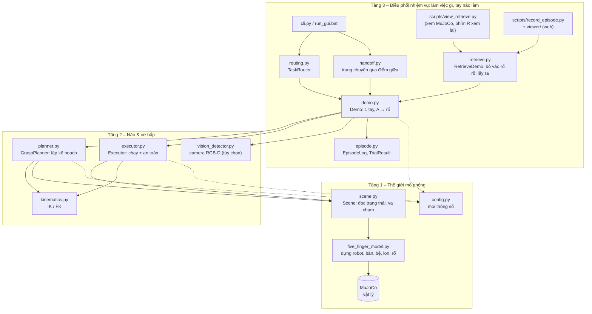
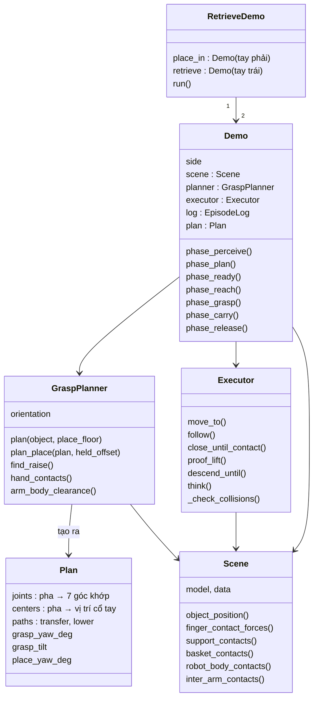
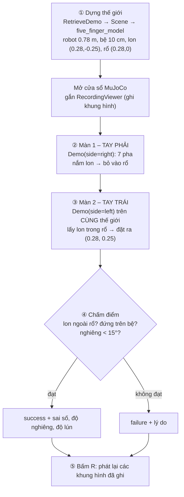
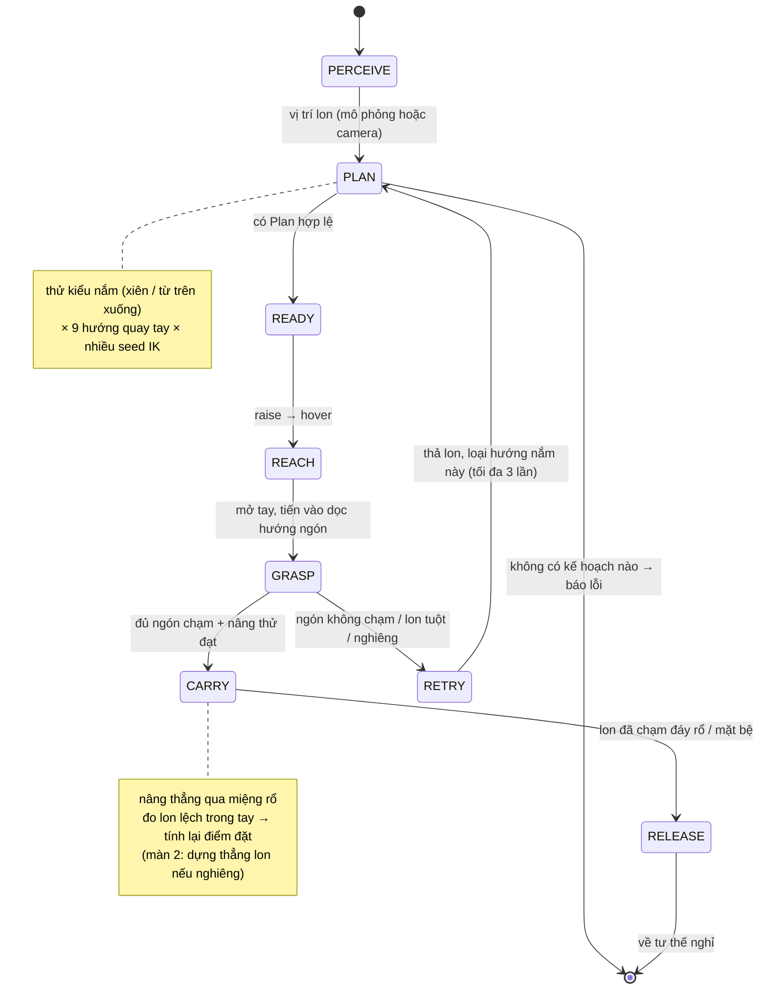
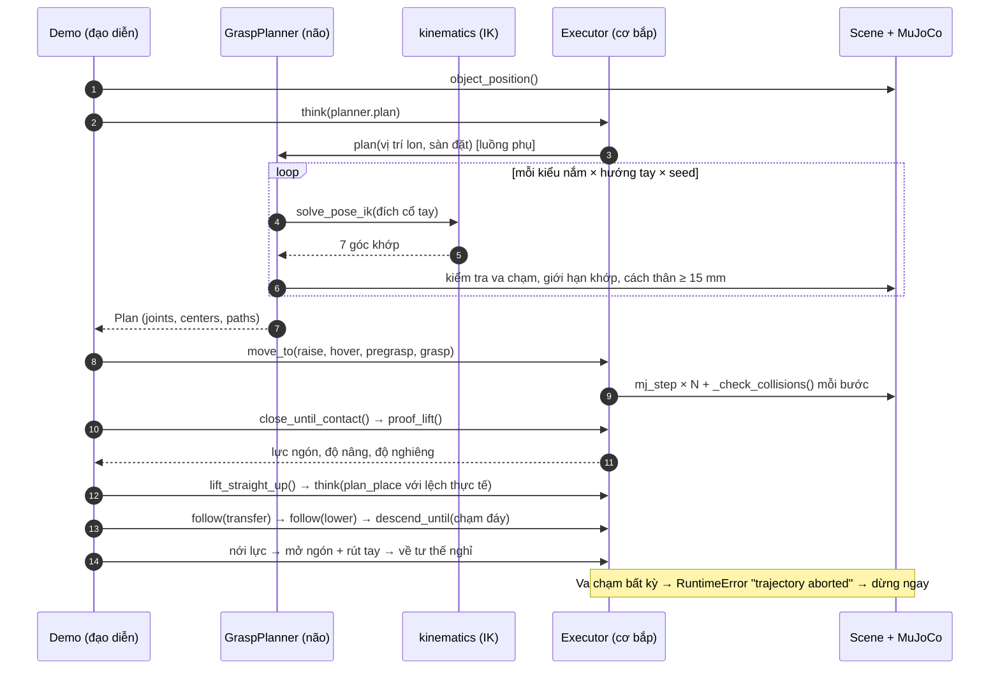
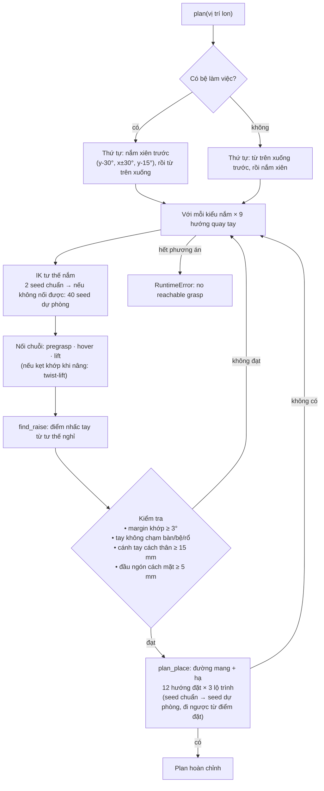
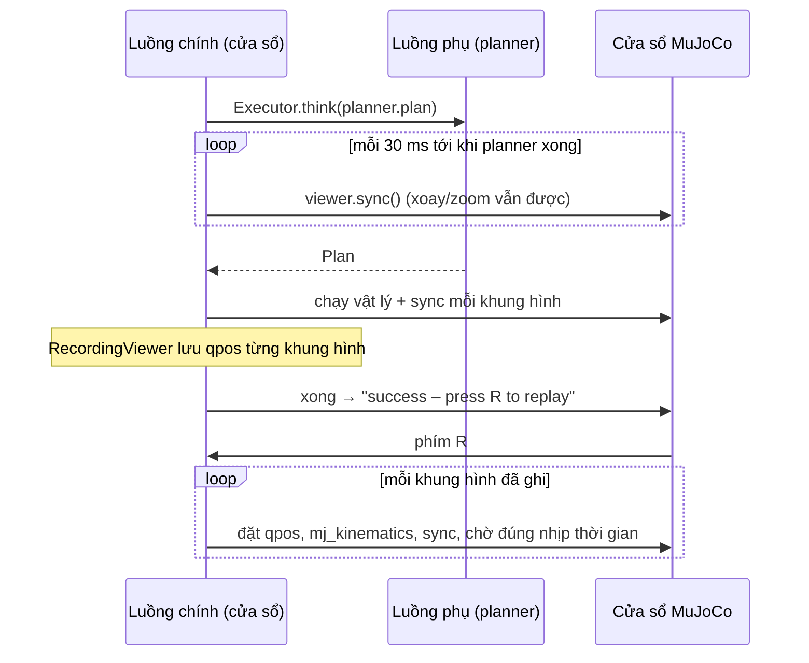
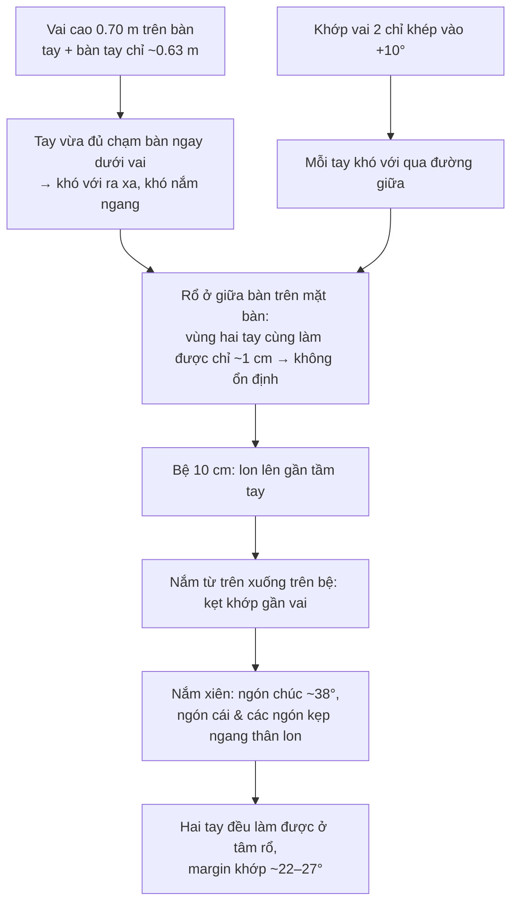

# Kiến trúc hệ thống — OpenArm + Inspire RH56 pick & place (MuJoCo)

Tài liệu này giải thích hệ thống mô phỏng gồm những khối nào, mỗi khối làm gì, và một lần
chạy đi qua các khối theo thứ tự nào. Ví dụ xuyên suốt là **bài chính**: tay phải nắm lon bỏ
vào rổ ở giữa bàn, tay trái lấy lon ra đặt ra ngoài (rổ trên bệ 10 cm).

```bash
python -m scripts.view_retrieve --place-arm right --retrieve-arm left \
    --pick 0.28 -0.25 --basket 0.28 0.0 --retrieve-to 0.28 0.25 --platform 0.10
```

---

## 1. Tổng quan: 3 tầng

Hình dung: **tầng 1 là sân khấu, tầng 2 là bộ não và cơ bắp, tầng 3 là đạo diễn.**



---

## 2. Từng khối làm gì

### Tầng 1 — Thế giới mô phỏng

| File | Vai trò |
|---|---|
| `simulation/five_finger_model.py` | Dựng mô hình MuJoCo: OpenArm (đỉnh 0.78 m, vai 0.697 m, camera 0.88 m — đúng robot thật) + 2 bàn tay Inspire RH56 + bàn + lon (trụ 10 cm) + rổ (18×18 cm, thành 5 cm). Tùy chọn: **bệ làm việc** (`work_platform_height`), bệ kê rổ, đáy rổ chữ V, xoay/tách đế tay (thí nghiệm). |
| `simulation/pick_place/scene.py` | `Scene`: vị trí/độ nghiêng lon, lon có trong rổ không, lực từng ngón, tư thế nghỉ, và các phép kiểm tra va chạm (bàn, bệ, rổ, thân robot, hai tay chạm nhau). |
| `simulation/pick_place/config.py` | Mọi con số (tốc độ, dung sai, độ cao nâng, danh sách hướng nắm…) kèm lý do và ngày đo. |

### Tầng 2 — Não & cơ bắp

| File | Vai trò |
|---|---|
| `kinematics.py` | **FK**: góc 7 khớp → vị trí/hướng cổ tay. **IK** (DLS): vị trí/hướng cổ tay mong muốn → góc 7 khớp. |
| `planner.py` | `GraspPlanner`: *tính trên giấy, không chạy vật lý*. Từ vị trí lon và rổ → chuỗi tư thế khớp cho mọi pha, đã kiểm tra va chạm và giới hạn khớp. |
| `executor.py` | `Executor`: đưa tay qua các tư thế trong vật lý MuJoCo, khép ngón theo lực, nâng thử, hạ tới khi chạm đáy; **kiểm tra an toàn ở mọi bước 1 ms**; `think()` chạy planner ở luồng phụ để cửa sổ không treo. |
| `vision_detector.py` | (tùy chọn) Tìm lon bằng ảnh RGB-D từ camera đầu. |

### Tầng 3 — Điều phối

| File | Vai trò |
|---|---|
| `demo.py` | `Demo`: **một tay, một việc** — nắm vật ở A, đặt vào rổ B, qua 7 pha. |
| `retrieve.py` | `RetrieveDemo`: **hai màn nối tiếp trong cùng một thế giới vật lý** — màn 1 (tay phải) bỏ vào rổ, màn 2 (tay trái) lấy ra đặt ra ngoài. |
| `routing.py` | `TaskRouter`: chọn tay phải / tay trái / trung chuyển / từ chối. |
| `handoff.py` | Trung chuyển qua điểm giữa bàn (hiện bị từ chối vì chưa ổn định). |
| `episode.py` | Nhật ký từng pha và kết quả `TrialResult`. |
| `cli.py`, `scripts/*` | Điểm vào: chạy dòng lệnh, xem MuJoCo, ghi video, quét tầm với. |

---

## 3. Lớp và quan hệ giữa chúng



---

## 4. Luồng chạy bài chính

### 4.1 Toàn cảnh



### 4.2 Bảy pha của một tay (`Demo`)



### 4.3 Ai gọi ai trong một màn (tuần tự)



---

## 5. Bên trong planner: tìm một kế hoạch



---

## 6. An toàn: ba lớp

```mermaid
flowchart LR
    subgraph L1["Lớp 1 – Planner (trước khi chạy)"]
        A1["margin khớp ≥ 3°"]
        A2["bàn tay không chạm bàn / bệ / rổ<br/>(chừa 2 cm trên đường nối)"]
        A3["cánh tay cách thân robot ≥ 15 mm"]
        A4["đầu ngón cách mặt làm việc ≥ 5 mm"]
    end
    subgraph L2["Lớp 2 – Executor (mỗi bước 1 ms)"]
        B1["tay / cánh tay chạm bàn hoặc bệ > 3 mm → DỪNG"]
        B2["chạm rổ > 3 mm → DỪNG"]
        B3["chạm thân robot → DỪNG"]
        B4["hai tay chạm nhau → DỪNG"]
        B5["tay đang nghỉ chạm lon → DỪNG"]
        B6["tốc độ khớp tay ≤ 0.6 rad/s"]
    end
    subgraph L3["Lớp 3 – Kiểm chứng kết quả"]
        C1["nâng thử: lon theo tay, trượt ≤ 1 cm, nghiêng ≤ 15°"]
        C2["mang: đáy lon cao hơn miệng rổ ≥ 5 cm"]
        C3["cuối: lon đúng chỗ, đứng thẳng"]
    end
    L1 --> L2 --> L3
```



---

## 7. Xem MuJoCo mượt: luồng phụ và phát lại



---

## 8. Vì sao bài chính cần bệ 10 cm và nắm xiên



---

## 9. Kết quả hiện tại (24/09/2026)

| Hạng mục | Kết quả |
|---|---|
| Bài chính (danh nghĩa) | thành công; sai số đặt 3–7 mm, nghiêng 0°, không lún |
| Lệch điểm nắm ±1.5 cm | 7/8 thành công (hỏng: (0.28,-0.235), tay phải cầm chưa chắc) |
| Toàn bộ test | 61/61 OK |
| Thời gian một lần chạy | ~75 s (trước tối ưu: 169 s); vật lý nhanh hơn thời gian thực 1.27× |

Chi tiết từng ngày, số liệu đo và các hướng đã thử: xem `context_project.md`.
