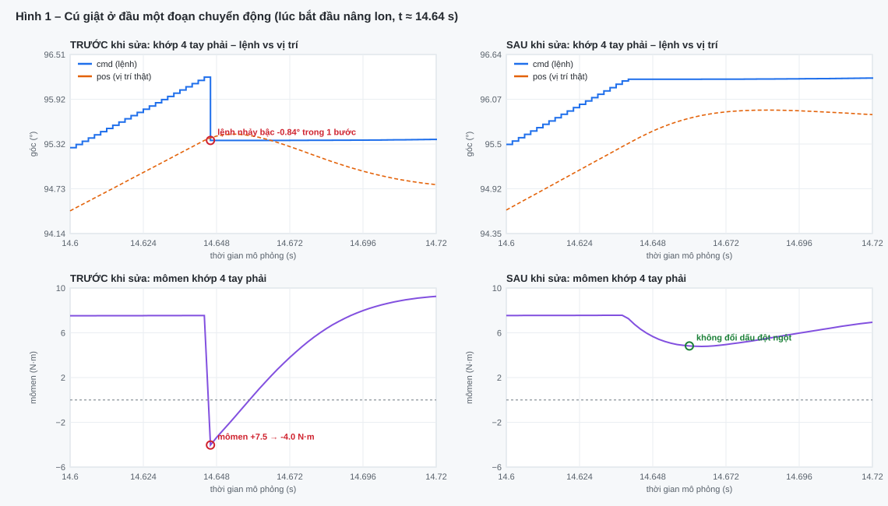
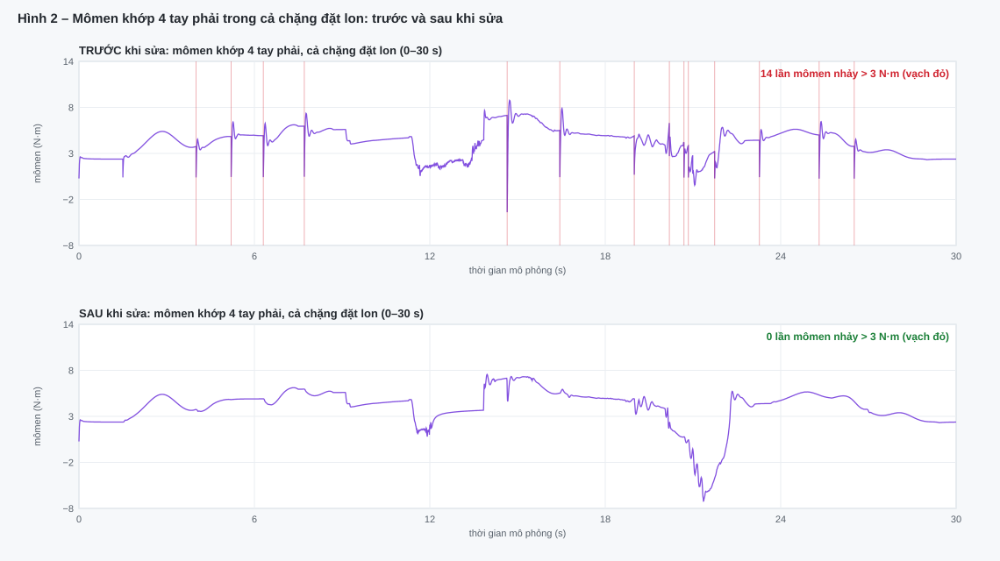
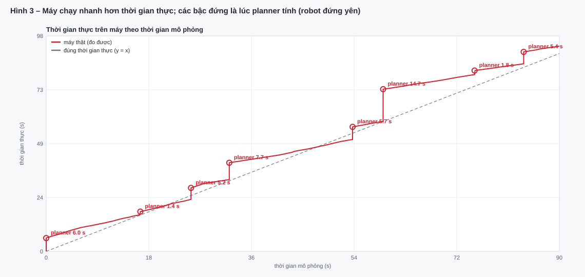

# Báo cáo: nguyên nhân robot bị giật — do máy hay do lệnh truyền vào?

*Ngày 24/09/2026. Bài kiểm tra: rổ ở giữa bàn trên bệ 10 cm, tay phải bỏ lon vào rổ, tay trái lấy ra.*

## Kết luận ngắn

| Câu hỏi | Trả lời |
|---|---|
| Cú giật (robot khựng / lắc) do đâu? | **Do lệnh truyền vào.** Đầu mỗi đoạn chuyển động, lệnh khớp nhảy bậc trong 1 ms → mômen đổi chiều ~11.6 N·m. |
| Có phải máy yếu không? | **Không.** Mô phỏng vật lý chạy nhanh gấp **2.6 lần** thời gian thực. |
| Vậy vì sao cửa sổ MuJoCo có lúc "đứng hình"? | Robot đang **lập kế hoạch** (1–15 s mỗi lần), vật lý tạm dừng — không phải giật. Phím **R** phát lại không có các đoạn này. |
| Đã sửa chưa? | **Rồi.** Sau khi sửa: 0 cú giật, bước mômen lớn nhất 0.6 N·m. Test 61/61, 20 bài ngẫu nhiên 20/20. |

---

## 1. Cách đo

- `scripts/log_joint_states.py` ghi **mỗi 2 ms mô phỏng** một dòng CSV cho cả 14 khớp tay:
  lệnh gửi (`cmd`), vị trí thật (`pos`), vận tốc, sai số bám, mômen động cơ;
  cùng **thời gian thực trên máy** (`wall_time`, `wall_dt_ms`) và cờ `thinking` (planner đang tính).
- File log mở được bằng **PlotJuggler** (File → Load Data, trục thời gian `sim_time`):
  `artifacts/joint_logs/retrieve_headless_plot.csv` (trước sửa), `…_fixed_plot.csv` (sau sửa).
- Các hình dưới được vẽ từ đúng hai file này (`python -m scripts.plot_joint_log`).

**Cách đọc để phân biệt nguyên nhân:**
- Nếu **đường lệnh (`cmd`) có bậc nhảy** → giật do **lệnh**.
- Nếu `cmd` trơn nhưng `pos` lắc → do **bộ điều khiển / servo**.
- Nếu thời gian thực trên máy tăng nhanh hơn thời gian mô phỏng khi robot đang chạy → do **máy chậm**.

---

## 2. Giật do lệnh truyền vào

**Hình 1** phóng to đúng lúc tay phải bắt đầu nâng lon (t ≈ 14.64 s), khớp 4:

- **Trước khi sửa (trái):** đường lệnh (xanh) đang tăng dần thì **tụt thẳng xuống 0.84° trong 1 bước** về đúng vị trí thật (cam). Ngay lúc đó mômen (tím, dưới) **rơi từ +7.5 xuống −4.0 N·m** — động cơ bị "giật ngược" rồi mới kéo lại.
- **Sau khi sửa (phải):** lệnh đi liền mạch từ giá trị đang có, mômen thay đổi êm, không đổi dấu đột ngột.

**Nguyên nhân trong code:** hàm `Executor.follow` bắt đầu mỗi đoạn chuyển động từ **vị trí khớp đo được** thay vì **lệnh đang gửi**. Động cơ luôn trễ sau lệnh 0.3–1°, nên đầu mỗi đoạn lệnh bị kéo lùi đúng khoảng trễ đó → một cú giật.

**Hình 2** là mômen khớp 4 tay phải trong cả chặng đặt lon. Mỗi vạch đỏ là một lần mômen nhảy > 3 N·m trong 2 ms:
**trước khi sửa 14 lần** (chặng này; cả bài 36 lần), **sau khi sửa 0 lần** — cú giật xuất hiện ở đầu *mọi* đoạn chuyển động, nên đây là lỗi hệ thống chứ không phải ngẫu nhiên.

| Chỉ số (cả bài, 14 khớp) | Trước khi sửa | Sau khi sửa |
|---|---|---|
| Số lần vận tốc lệnh vượt 69 °/s | 39 | **0** |
| Vận tốc lệnh cao nhất | 418 °/s | **65 °/s** |
| Số lần mômen nhảy > 3 N·m / 2 ms | 36 | **0** |
| Bước nhảy mômen lớn nhất | 11.6 N·m | **0.6 N·m** |

---

## 3. Không phải do máy

**Hình 3** vẽ thời gian thực trên máy (đỏ) theo thời gian mô phỏng. Đường xám nét đứt là "đúng thời gian thực".

- Khi robot đang chuyển động, đường đỏ **thoải hơn** đường xám: 2 ms mô phỏng chỉ tốn trung bình **0.77 ms** trên máy (99% các bước < 3.5 ms) → máy **nhanh gấp 2.6 lần** thời gian thực, dư sức.
- Các **bậc đứng** (1.4 – 14.7 s) là lúc **planner đang tính kế hoạch** (cột `thinking = 1`). Trong lúc đó vật lý dừng, robot đứng yên — người xem thấy "đứng hình", nhưng đây là thời gian tính toán của thuật toán, không phải máy yếu hay robot giật.

---

## 4. Đã sửa gì

| Thay đổi | File |
|---|---|
| Cánh tay bắt đầu mỗi đoạn chuyển động từ **lệnh đang gửi** (bàn tay giữ cách cũ để thả vật đúng) | `simulation/pick_place/executor.py` |
| Sau bước nâng thử, siết lại ngón nào đang ép < 5 N (chuyển động mượt hơn làm lộ vài cách nắm lỏng) | `simulation/pick_place/demo.py`, `config.py` (`REGRIP_BELOW_N`) |
| Cánh tay cách thân robot ≥ 30 mm, kiểm tra dọc cả đường mang | `simulation/pick_place/planner.py` |
| Ghi log khớp cho PlotJuggler / vẽ hình báo cáo | `scripts/log_joint_states.py`, `scripts/plot_joint_log.py` |
| Cửa sổ MuJoCo không treo khi planner tính; phím R phát lại mượt | `executor.py` (`think`), `scripts/view_retrieve.py` |

**Kiểm chứng:** toàn bộ test 61/61; 20 bài ngẫu nhiên có camera 20/20; bài chính thành công (lệch 2.1 mm, nghiêng 0°, không va chạm).

## 5. Việc nên làm tiếp

- Giảm thời gian lập kế hoạch (nguồn "đứng hình" còn lại): lưu sẵn kế hoạch cho các vị trí hay dùng, hoặc lập kế hoạch chặng sau trong lúc chặng trước đang chạy.
- Khi chuyển sang robot thật (ROS 2), dùng cùng cách đo: ghi `/joint_states` và lệnh gửi xuống driver, mở trong PlotJuggler để kiểm tra lệnh không có bậc nhảy.
